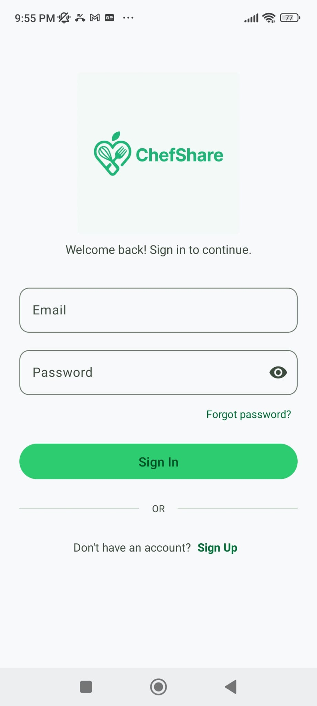
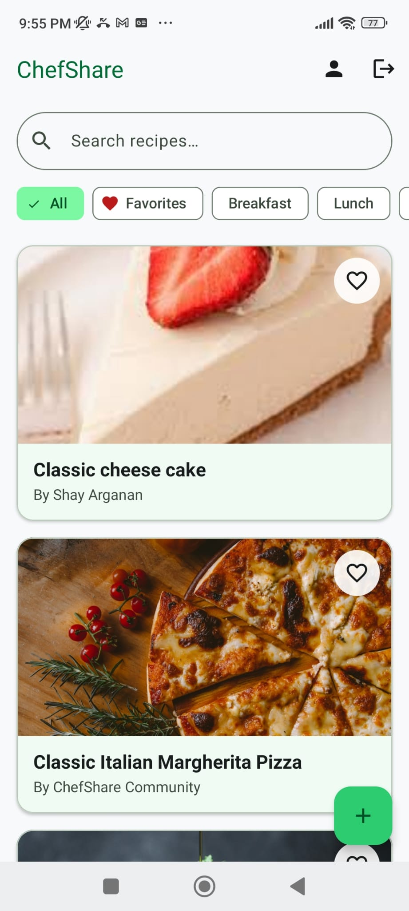
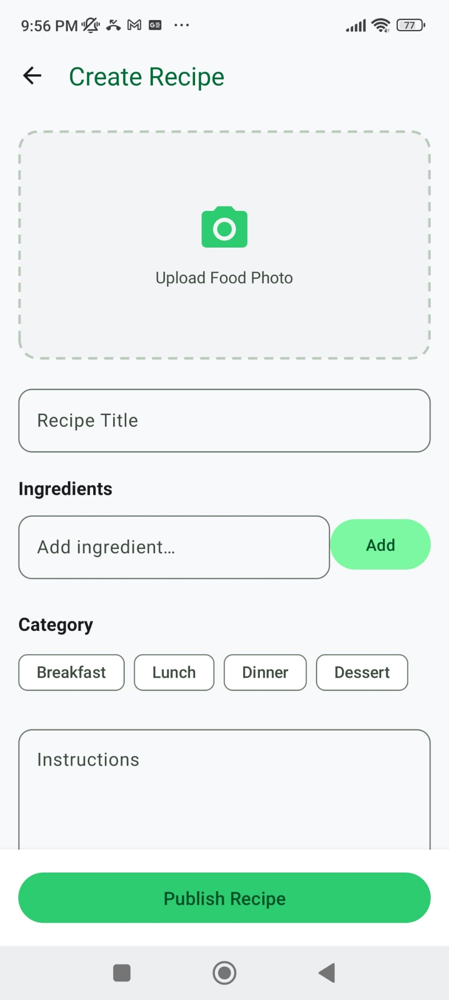
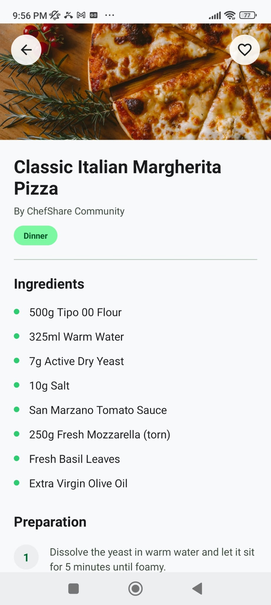

# ChefShare

An Android application for sharing and browsing culinary recipes, built with Kotlin and Firebase.

ChefShare is designed as a clean, distraction-free platform where home cooks can upload recipes, search through community submissions, filter by category, and save favorites in real time.

---

## Author

**Shay Argaman (שי ארגמן)**

- **ID:** 207689274
- **Course Code:** 26B10208

---

## Demo Video

)

> *Click the image above to watch the full walkthrough on YouTube (or replace with your Drive/Vimeo link).*

---

## App Screenshots

| Login Screen | Community Feed | Add Recipe | Recipe Details |
| :---: | :---: | :---: | :---: |
|  |  |  |  |

---

## Demo Accounts

For quick testing and review, you can use the following pre-configured credentials:

| Email | Password | Display Name | Note |
| :--- | :--- | :--- | :--- |
| `shay@gmail.com` | `shay123` | Shay Argaman | My Personal Account |
| `chef@gmail.com` | `shay123` | ChefShare Community | Seed Data Account |

---

## Key Features

* **Authentication**: Email/Password login and registration powered by Firebase Auth.
* **Community Feed**: Live list of shared recipes populated in real time from Cloud Firestore.
* **Search & Category Filtering**: Quick text search and single-select category chips (Breakfast, Lunch, Dinner, Dessert, and Favorites).
* **Recipe Creation**: Upload new recipes with titles, category tags, step-by-step instructions, dynamic ingredient chips, and dish photos selected via Android's Photo Picker (`PickVisualMedia`).
* **Favorites System**: Atomic likes synced via Firestore array operations (`likedByUsers`), allowing users to bookmark recipes and view them under the Favorites filter.
* **Recipe Details**: Expanded view with high-resolution hero images, ingredients lists, and numbered preparation steps.

---

## Architecture & Tech Stack

The app follows the standard **MVVM (Model-View-ViewModel)** architectural pattern to keep UI logic separated from data handling.

* **Language**: 100% Kotlin
* **UI**: XML Layouts with Material 3 components
* **Architecture**: MVVM with LiveData and ViewModels
* **Backend Services**:
  * **Firebase Authentication**: User session management
  * **Cloud Firestore**: Real-time NoSQL database
  * **Firebase Storage**: Image hosting
* **Third-Party Libraries**:
  * **Glide**: Image loading and caching
  * **SwipeRefreshLayout**: Pull-to-refresh feed functionality

---

## Setup & Running the Project

1. Clone or download this repository.
2. Open the project in Android Studio (Koala / Ladybug or newer recommended).
3. Ensure you have your `google-services.json` file inside the `app/` directory (configured for Firebase Auth, Firestore, and Storage).
4. Sync project with Gradle files.
5. Build and run on an Emulator or physical device (Android 8.0 / API 26+).
